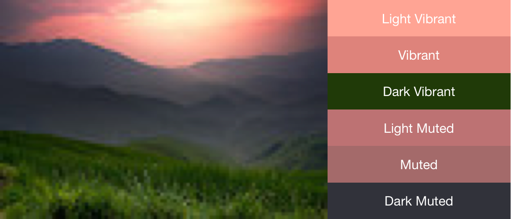

# Palette
Extract prominent colors from an image. Working with [NetVips](https://github.com/kleisauke/net-vips).




## Install

First Install NetVips. [Docs here](https://github.com/kleisauke/net-vips#install).

Then install this package:

```
Install-Package NetVips
```

## Usage

See [PaletteTests.cs](https://github.com/EYHN/Palette/blob/main/Palette.Test/PaletteTests.cs)